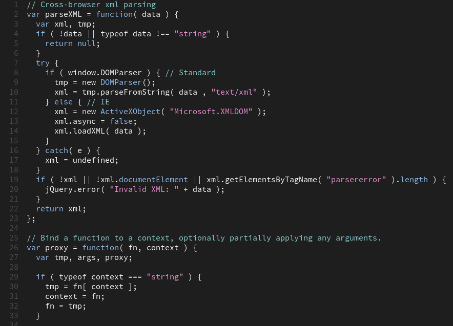

# Cyanic Pastels Color Theme

A simple, to-the-point dark theme, with a nice CMYK-like color scale. Inspired
by the Visual Studio Dark theme as well as other widespread themes such as the
MATLAB default, it tries to stay with with widely established preferred colors
for the most important bits in code: comments, strings and keywords, and to
place these colors in a balanced way on the color wheel, since these three
tend to be somewhat evenly distributed across most code. The addition of a
CMYK like color shift, gives the "cyanic" feel, which is more pleasing to
the eye, according to undersigned.

### For more information
* [Visual Studio Code's Markdown Support](http://code.visualstudio.com/docs/languages/markdown)
* [Markdown Syntax Reference](https://help.github.com/articles/markdown-basics/)

**Enjoy!**
